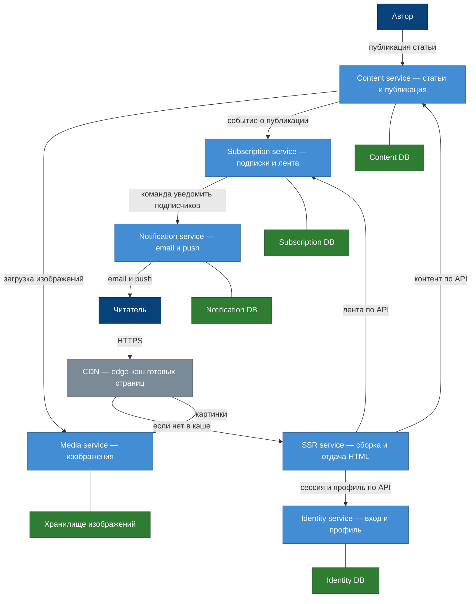

# Декомпозиция на сервисы

## Шаг 1. Возможности и поддомены

Бизнес-возможности платформы и их тип поддомена (core / supporting / generic):

| Возможность | Тип | Почему так |
|-------------|-----|------------|
| Публикация статей — создание, редактирование и публикация автором | core | Ради этого продукт существует; удобство работы автора прямо отличает нас от конкурентов |
| Чтение и доставка статей — отдача готовых страниц читателю | core | Конкурентное преимущество (скорость, SEO); на этом завязаны драйверы D1, D2, D4 |
| Подписки и лента — подписка на автора, персональная лента | supporting | Специфично для нас, удерживает аудиторию, но не главное отличие от конкурентов |
| Аутентификация и профиль — регистрация, вход, профиль | generic | Решается стандартно (готовый провайдер идентификации) |
| Медиа — загрузка, хранение и раздача изображений | generic | Объектное хранилище (S3) и CDN — коммодити |
| Уведомления — email и push подписчикам о новой статье | generic | Типовой поддомен, покрывается готовыми провайдерами рассылок |

**Логика разметки.** core — то, что отличает продукт (создание контента и
быстрая SEO-доставка чтения); supporting — наше, но вспомогательное (вовлечение
через подписки); generic — решается готовыми решениями (аутентификация,
хранилище, рассылки).

## Шаг 2. Границы сервисов

Группируем возможности в сервисы преимущественно by Subdomain (границы совпадают с
поддоменами из Шага 1); «Чтение и доставка» выделена by Business Capability как
отдельная задача доставки. Каждый сервис владеет своими данными — общей БД нет.

| Сервис | Возможность | Ответственность (одна фраза) | Владеет данными |
|--------|-------------|------------------------------|-----------------|
| Content service | Публикация статей | Хранит статьи и ведёт их от черновика до публикации, отдаёт контент по API | Статьи, разделы, метаданные, статусы публикации (Content DB) |
| SSR service | Чтение и доставка статей | Собирает и отдаёт готовые HTML-страницы читателям и краулерам | Своих данных не хранит (stateless); кэш готовых страниц — на CDN |
| Subscription service | Подписки и лента | Хранит подписки читателей на авторов и формирует ленту | Подписки reader→author, лента (Subscription DB) |
| Identity service | Аутентификация и профиль | Аутентифицирует пользователей и хранит профили | Учётные записи, сессии, профили (Identity DB) |
| Media service | Медиа | Принимает, хранит и отдаёт изображения статей | Файлы изображений и их метаданные (объектное хранилище) |
| Notification service | Уведомления | Рассылает подписчикам email и push о новой статье | Шаблоны, очередь и статусы доставки (Notification DB) |

Общей БД нет: SSR service читает контент через API Content service, а не из его
базы; уведомление о новой статье идёт цепочкой Content → Subscription →
Notification через событие и команду, без доступа к чужим данным (детали в Шаге 3).

## Шаг 3. Сплочённость и связанность

**Сплочённость — каждый сервис «про одно».**

- **Content service** — только статьи и их жизненный цикл; не знает о пользователях и рассылках.
- **SSR service** — только сборка и отдача HTML; контент не хранит.
- **Subscription service** — только связи «читатель → автор» и лента.
- **Identity service** — только вход и профиль.
- **Media service** — только изображения статей.
- **Notification service** — только доставка сообщений.

**Риск связанности и как его снимаем.** Самый острый риск — рассылка о новой
статье задевает сразу три сервиса: Content знает о факте публикации, Subscription
— кто подписан на автора, Notification — как доставить. Наивная реализация читала
бы подписки из базы Subscription, а факт публикации — из базы Content, то есть
лезла бы в чужие данные и де-факто вводила общую БД.

Снимаем **событием и контрактом**. При публикации Content service эмитит доменное
событие «Статья опубликована» (id автора и статьи, заголовок). Subscription
service подписан на это событие, по своим данным разворачивает список подписчиков
и передаёт Notification service команду «уведомить этих пользователей о статье» —
по контракту, без доступа к чужим базам. Каждый сервис работает только со своими
данными: связь идёт через событие (Content → Subscription) и контракт
(Subscription → Notification).

## Шаг 4. Карта сервисов и пример DIP

На связях подписано, что по ним передаётся. У каждого сервиса — своя база; общей
нет.

**Пример DIP.** SSR service зависит не от конкретной реализации Content service и
тем более не от его базы, а от контракта его API — «получить опубликованную статью
по slug». За контрактом реализацию можно заменить (сменить хранилище, кэш, движок
контента), и SSR service от этого не меняется. Зависимость направлена на
абстракцию-контракт, а не на детали реализации.
