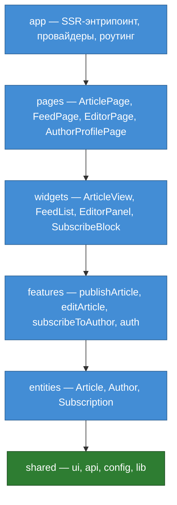

# Фронтенд-архитектура

Как устроен фронтенд сквозного проекта: декомпозиция по FSD, модель рендеринга и
сборки, масштабирование и контур CI/CD. Опирается на драйверы из
[`../README.md`](../README.md), атрибуты качества из
[`01-quality-attributes.md`](01-quality-attributes.md) и границы сервисов из
[`04-decomposition.md`](04-decomposition.md).

Документ собирается по частям (одно ДЗ на модуль):

1. Декомпозиция фронтенда (FSD) — ниже.
2. Рендеринг и сборка — вынесено в [`05-rendering-delivery.md`](05-rendering-delivery.md).
3. Масштабирование (monorepo vs microfrontend) — ниже.
4. Контур CI/CD — ниже.
5. Ключевые решения в логике ADR — [`adr/0001-use-ssr.md`](adr/0001-use-ssr.md)
   (SSR), [`adr/0002-frontend-fsd.md`](adr/0002-frontend-fsd.md) (FSD),
   [`adr/0003-frontend-monolith.md`](adr/0003-frontend-monolith.md) (монолит).

## Декомпозиция по FSD

**Решение.** Используем FSD как базовую структуру фронтенда: слои,
Public API (`index.ts`) и импорт только из нижних слоёв. Внутри срезов пока не
вводим полный набор сегментов и Clean Architecture; добавляем их только там, где
фича действительно стала сложной. API-запросы держим в `api`-сегменте
соответствующего среза.

**Почему FSD, а не Layered.** Проект долгоживущий и уже содержит несколько
доменов (из [`04-decomposition.md`](04-decomposition.md): контент, подписки,
идентификация) — явные границы FSD окупаются на модифицируемости. Сейчас это
учебный проект с одним разработчиком, поэтому полный FSD был бы лишним. Берём
только правила, которые помогают держать границы: слои, Public API и запрет
импортов вверх. Сегменты и Clean Architecture появятся только при росте
конкретной фичи.

### Слои и срезы

Слои сверху вниз; выше по списку — ближе к точке входа.

| Слой | Срезы у нас | Назначение |
|------|-------------|------------|
| app | SSR-энтрипоинт, провайдеры, роутинг | точки входа и глобальная сборка |
| pages | `ArticlePage`, `FeedPage`, `EditorPage`, `AuthorProfilePage` | целые страницы под маршруты |
| widgets | `ArticleView`, `FeedList`, `EditorPanel`, `SubscribeBlock` | самодостаточные крупные блоки |
| features | `publishArticle`, `editArticle`, `subscribeToAuthor`, `auth` | переиспользуемые действия |
| entities | `Article`, `Author`, `Subscription` | бизнес-сущности |
| shared | `ui`, `api`, `config`, `lib` | общий код, на срезы не делится |

### Правило зависимостей

Слой импортирует только из слоёв ниже себя (из любого нижнего, не только
соседнего), а к чужому срезу обращается только через его Public API (`index.ts`),
не по внутренним путям. Граф зависимостей ацикличен; циклы ловим статически
правилом `import/no-cycle`.

Стрелка — разрешённое направление импорта. Показаны соседние переходы; правило
шире — любой слой может импортировать из любого слоя ниже.

### Границы домена и чем они найдены

Entity-срезы соответствуют владельцам данных из
[`04-decomposition.md`](04-decomposition.md): `Article` ↔ Content service,
`Subscription` ↔ Subscription service, `Author` ↔ провайдер идентификации. На
фронтенде это обычные FSD-срезы с Public API для своих сущностей; сами bounded
contexts остаются на уровне сервисов. Границу проводили по двум сигналам:

- **CRUD-владение данными** — кто сущность создаёт, тот владелец; остальные срезы
  только читают её через Public API. Два владельца одной сущности означали бы
  неверную границу.
- **Ubiquitous Language** — «статья» значит одно и то же везде, поэтому одна
  сущность `Article`; «профиль автора» и «подписка на автора» — разный смысл,
  поэтому разные срезы (`Author` и `Subscription`).

### API-слой

Общение с бэкендом раскладывается по границам FSD, а не сваливается в один общий
модуль:

- В `shared/api` — только базовый инфраструктурный клиент: `baseURL`, заголовки,
  обработка ошибок, транспорт. Он не знает про домены. Смысл тот же, что у
  слоя-адаптера, — при смене baseURL или обработки ошибок правится один файл, а не
  разбросанные по компонентам вызовы `fetch`.
- Доменные запросы и BIF-нормализация живут в `api`-сегменте своего среза
  (`entities/Article/api`, `entities/Author/api`, `entities/Subscription/api` или
  api соответствующей фичи) и наружу отдаются только через Public API (`index.ts`).
  Так доменные контракты не смешиваются с общим клиентом и не обходят границы
  срезов.

Два паттерна из конспекта под нашу задачу:

- **BFF у нас уже есть по факту.** SSR service агрегирует три бэкенда (Content,
  Subscription, провайдер идентификации) в один HTML-ответ — это и есть роль
  Backend-for-Frontend, сокращающая round-trip’ы. Отдельный инфраструктурный BFF
  заводить не нужно.
- **BIF-нормализация — точечно на границе внешнего провайдера.** Внутренние
  сервисы отдают уже наши контракты; «грязный» формат внешнего провайдера
  идентификации нормализуем одним нормалайзером — в `api`-сегменте
  соответствующего среза, а не в общем `shared/api`, чтобы остальной код не знал
  его особенностей.

### Связь с остальной архитектурой

- **Модифицируемость** (атрибут из [`01-quality-attributes.md`](01-quality-attributes.md)):
  изменение внутри среза не расползается по проекту — снаружи виден только Public
  API.
- **Производительность:** граница редактора в FSD (`EditorPage` + `editArticle` +
  `EditorPanel`) совпадает с точкой code splitting из
  [`05-rendering-delivery.md`](05-rendering-delivery.md) — тяжёлый редактор
  грузится отдельным чанком на маршруте редактора и не утяжеляет страницу чтения.
  Модифицируемость и производительность тянут границу в одну сторону.

## Масштабирование: monorepo vs microfrontend

Конспект вебинара разделяет три вопроса: где лежит код, чем он собирается и
сколько частей выкатывается независимо. Для проекта выбираем простой вариант:
код фронтенда лежит в одном репозитории, собирается обычным npm/bundler без
Nx/Turborepo/Bazel, а в прод уезжает одним SSR-деплоем.

**Решение.** Микрофронтенды сейчас не вводим. Фронтенд остаётся единым
приложением с внутренними FSD-границами; к независимым деплой-юнитам вернёмся
только если появятся автономные команды и отдельные релизные циклы.

### Доводы (по decision framework)

**1. Все четыре вопроса framework дают «нет».** Конспект: если хотя бы на один
ответ «нет», микрофронтенды сейчас решают несуществующую проблему.

- Независимых команд-владельцев UI сейчас — одна (закон Конвея: одна граница
  владения).
- Независимый релизный цикл сегодня не нужен.
- DevOps-мощности на инфраструктуру Module Federation (CDN с версионированием,
  feature-flag сервис, мониторинг каждой части) — нет.
- Совпадение границы микрофронтенда с границей команды не проверить: отдельной
  команды-владельца нет.

**2. SLA и blast radius — привязка к драйверу D4.** В микрофронтендах страница
может зависеть сразу от нескольких отдельно загружаемых частей: оболочки сайта и
нескольких модулей. Если для открытия страницы нужны все эти части, то отказ
любой из них ломает пользовательский сценарий. Поэтому итоговая доступность
считается как произведение: четыре части с SLA 99.9% дают `0.999^4 ≈ 99.6%`.
Для публичного сайта это хуже драйвера D4: простой сразу превращается в потерю
трафика. У одного фронтенд-монолита такой дополнительной зависимости между
частями нет.

**3. Модифицируемость уже закрыта проще.** Нам нужны понятные границы в коде, а
не независимый деплой каждой части интерфейса. Эти границы даёт FSD: статья,
подписки, автор и редактор лежат в своих срезах и доступны через Public API.
Так мы можем менять части фронтенда отдельно, но не добавляем инфраструктуру и
договорённости, которые нужны микрофронтендам.

### Что осознанно не делаем (антипаттерны из конспекта)

- Не вводим Nx/Turborepo/Bazel, пока нет проблемы долгой сборки и нескольких
  пакетов, которым нужен общий кэш задач.
- Не делим фронтенд на микрофронтенды, пока части интерфейса всё равно
  выпускаются вместе и принадлежат одной команде.

## Контур CI/CD

Эскиз контура доставки и эксплуатации фронтенда. Отвечает на пять вопросов:
этапы pipeline, среды, где крутится SSR, CDN, масштабирование.

### Этапы pipeline

Принципы, на которых держится контур:

- **Собрать один раз, развернуть много раз** — через все среды едет один и тот же
  образ, не пересобирается на каждом шаге.
- **Тег образа = commit SHA**, а не `latest` — иначе не сказать, какой код в
  проде, и не откатиться на конкретную версию.
- **Deploy ≠ release** — образ можно выкатить заранее, а новую функциональность
  включить позже через feature-toggle или конфиг.
- Практические правила pipeline: секреты храним в CI, зависимости и слои образа
  кэшируем, нестабильные тесты исправляем.

### Среды

`dev` (работает ли код вообще) → `staging` / pre-prod (интеграция с реальными
сервисами, близко к проду) → `prod` (настоящие пользователи). Для pull request
поднимаем **временную preview-среду**: отдельный адрес, где можно проверить
конкретное изменение до слияния. После закрытия pull request эта среда удаляется.
Preview не заменяет staging: preview проверяет одну правку, staging — собранную
версию перед продом.

### Где физически крутится SSR

SSR service — долгоживущий Node-процесс в контейнере, на нашей инфраструктуре за
балансировщиком. Процесс stateless, состояние между запросами не хранит.
Health-check `/healthz` проверяет состояние самой реплики: процесс запущен,
принимает HTTP-запросы и готов обслуживать трафик. Общие зависимости вроде
Content service не должны снимать все SSR-реплики с балансировщика разом; их сбой
обрабатывается как деградация чтения через кэш/CDN и отдельный мониторинг.
Статика (JS/CSS-чанки, картинки) в образ сервиса не входит — её раздаёт CDN, это
отдельная, более дешёвая единица развёртывания.

### CDN

Да. CDN — edge-кэш готового HTML и раздача статики. Связь SSR-сервиса с CDN — не
отдельная интеграция, а стандартный заголовок ответа `Cache-Control`
(`s-maxage`, `stale-while-revalidate`). Неперсонализированные страницы CDN отдаёт
без похода на origin; персонализированное (лента) доходит до сервиса. Это уже
заложено в сценариях [S1](02-utility-tree.md#s1-отдача-страницы-статьи-под-нагрузкой--h-m),
[S2](02-utility-tree.md#s2-отказ-content-service-отдаём-из-кэша--h-m) и
[S3](02-utility-tree.md#s3-всплеск-трафика-в-10-раз--m-m).

### Масштабирование: горизонтальное

SSR service масштабируется горизонтально: несколько stateless-реплик работают за
балансировщиком. Это закрывает S3 и D1 по всплескам трафика, а также помогает D4:
при падении одной реплики остальные продолжают обслуживать запросы. Кэш публичных
страниц остаётся на CDN; отдельное хранилище кэша здесь не вводим.

Этот контур поддерживает два runtime-драйвера: D1 закрываем через CDN и несколько
SSR-реплик, D4 — через откат на конкретный SHA, health-check и отсутствие одной
обязательной реплики. D3 сюда не относится: pipeline доставляет код, а свежесть
статей обеспечивает runtime-публикация через Content service и CDN TTL
([S4](02-utility-tree.md#s4-актуальность-опубликованной-статьи--m-l)).

Чтобы деплой оставался воспроизводимым, не используем тег `latest`, не
пересобираем образ отдельно для каждой среды и не прячем нестабильные тесты за
повторным запуском.
