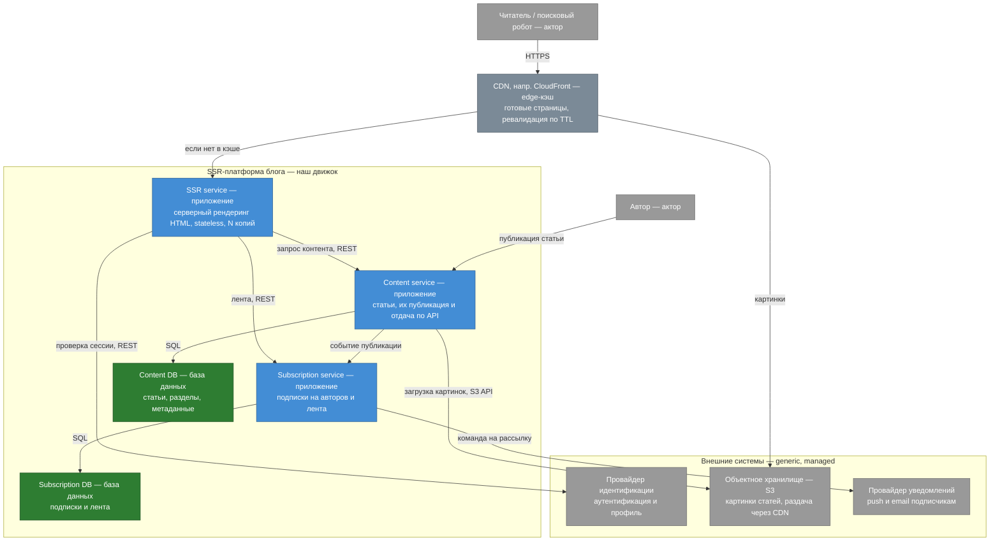

# C4, уровень 2 — Containers

Читатель — актор с уровня Context, а не контейнер. CDN показан на границе
платформы как кэш готовых страниц — через него проходит весь путь чтения.

## Диаграмма

## Контейнеры и связанные с ними требования

Путь запроса идёт сверху вниз, и по дороге видно, где живёт какой сценарий
качества.

**CDN** — внешняя managed-инфраструктура на границе чтения, не наш сервис: вход в
систему и кэш готовых страниц, через неё же читателям раздаются картинки. Если
страница есть в кэше, origin не вызывается вообще — это TTFB ≤ 200 мс из
[S1](../02-utility-tree.md#s1-отдача-страницы-статьи-под-нагрузкой--h-m) и
поглощение всплесков из
[S3](../02-utility-tree.md#s3-всплеск-трафика-в-10-раз--m-m). При отказе origin CDN
отдаёт ранее сохранённую копию — это graceful degradation из
[S2](../02-utility-tree.md#s2-отказ-content-service-отдаём-из-кэша--h-m); конкретный
механизм — вопрос следующих модулей.

**SSR service** — приложение серверного рендеринга. Если нужной страницы в кэше
нет, собирает её из Content service (а сессию и профиль проверяет у внешнего
провайдера идентификации) и отдаёт с заголовками кэширования (Cache-Control),
которые управляют edge-кэшем и ревалидацией. Приложение stateless — состояние
между запросами не хранит, поэтому масштабируется горизонтально (S3).

**Content service + Content DB** — единый владелец контента: автор через него
создаёт и публикует статьи, а SSR service читает их по API. Один сервис — одна
база, общего хранилища с другими сервисами нет. Как опубликованная статья доходит
до читателей — вопрос реализации; требование по сроку — сценарий
[S4](../02-utility-tree.md#s4-актуальность-опубликованной-статьи--m-l) (≤ 30 минут),
компромисс — в [`../03-tradeoffs.md`](../03-tradeoffs.md). Границы сервисов и
владение данными разобраны в [`../04-decomposition.md`](../04-decomposition.md).

**Subscription service + Subscription DB** — подписки читателей на авторов и
персональная лента; SSR service берёт ленту по API.

**Внешние системы (generic, managed).** Три поддомена вынесены наружу — платформа
только интегрируется с ними по контракту:

- **Провайдер идентификации** — аутентификация и профиль; SSR service ходит к нему
  за проверкой сессии.
- **Объектное хранилище (S3)** — картинки статей Content service загружает туда, в
  своей БД платформа их не держит, а читателям они раздаются через CDN.
- **Провайдер уведомлений** — при публикации Content service шлёт событие «статья
  опубликована» в Subscription service; тот разворачивает подписчиков и командует
  провайдеру разослать push и email.
