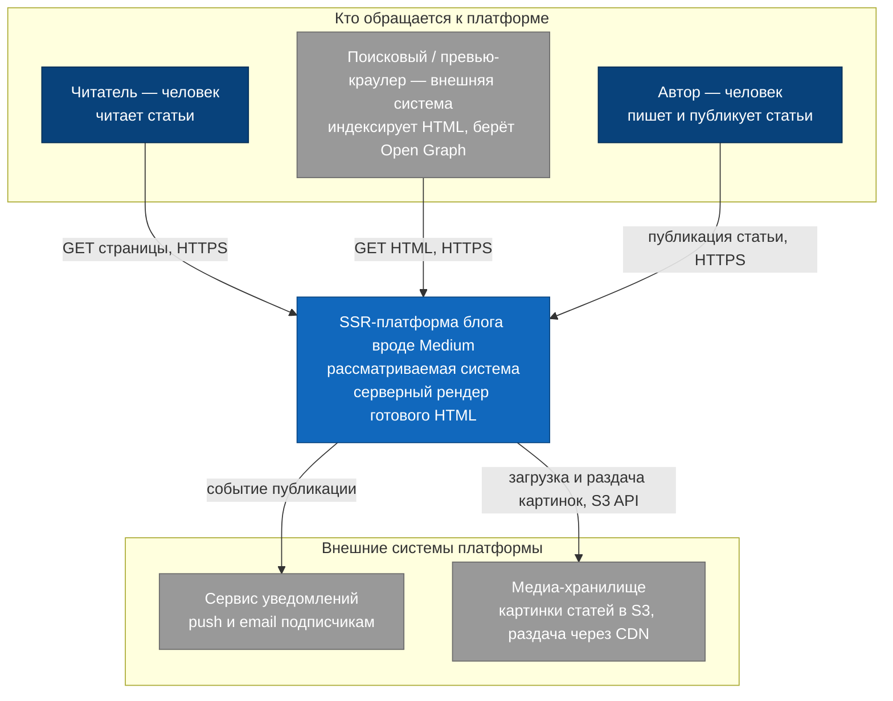

# C4, уровень 1 — System Context

## Диаграмма

## Пояснения

Центр — SSR-платформа, наша зона ответственности. Сверху — кто обращается к
платформе: читатель и превью-краулер получают готовый HTML (краулер важен для SEO
и Open Graph — драйвер D2), автор пишет и публикует статьи (драйвер D3).

Снизу — внешние системы, к которым платформа обращается сама, но которые не входят
в её границы:

- **Сервис уведомлений** — платформа шлёт события (например, «автор опубликовал
  статью»), а сервис рассылает push и email подписчикам.
- **Медиа-хранилище** — картинки статей платформа держит не в своей БД, а в
  объектном хранилище (S3) и раздаёт через CDN.

Как платформа устроена внутри (SSR Service, внутренние API), на этом уровне не
раскрывается — детали на уровне [Containers](c4-container.md).
