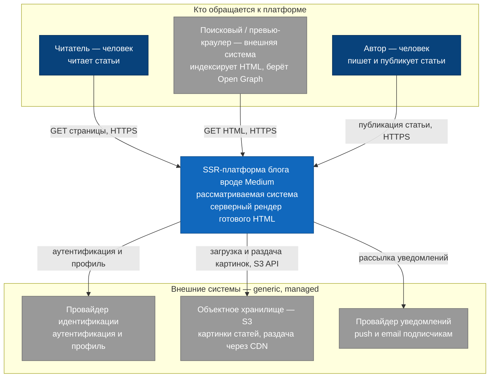

# C4, уровень 1 — System Context

## Диаграмма

## Пояснения

Центр — SSR-платформа, наша зона ответственности (движок: рендеринг, контент,
подписки). Сверху — кто обращается к платформе: читатель и превью-краулер получают
готовый HTML (краулер важен для SEO и Open Graph — драйвер D2), автор пишет и
публикует статьи (драйвер D3).

Снизу — внешние управляемые системы (generic-поддомены), к которым платформа
обращается по API, но которые не входят в её границы:

- **Провайдер идентификации** — аутентификация и профиль пользователей.
- **Объектное хранилище (S3)** — картинки статей платформа держит не у себя, а в
  объектном хранилище и раздаёт через CDN.
- **Провайдер уведомлений** — платформа шлёт запрос на рассылку, провайдер
  доставляет push и email подписчикам.

CDN (edge-кэш) — внешняя managed-инфраструктура на границе чтения: отдельным блоком
на контекстном уровне не показана, но через неё идёт доставка HTML и картинок
(детали — на уровне Containers).

Как платформа устроена внутри (SSR service, Content service, Subscription service),
на этом уровне не раскрывается — детали на уровне [Containers](c4-container.md).
